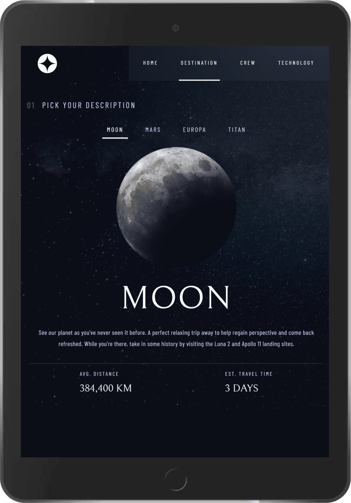
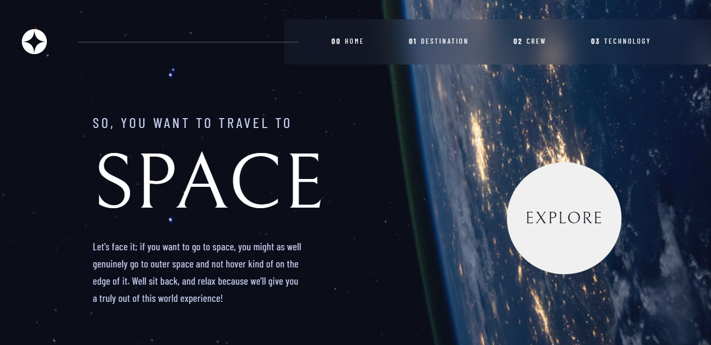

# Frontend Mentor - Space tourism website solution

## Table of contents

- [Overview](#overview)
  - [The challenge](#the-challenge)
  - [Screenshot](#screenshot)
  - [Links](#links)
- [My process](#my-process)
  - [Built with](#built-with)
  - [What I learned](#what-i-learned)
  - [Continued development](#continued-development)
  - [Useful resources](#useful-resources)
- [Author](#author)

## Overview

### The challenge

Users should be able to:

- View the optimal layout for each of the website's pages depending on their device's screen size
- See hover states for all interactive elements on the page
- View each page and be able to toggle between the tabs to see new information

### Screenshot






### Links

- Solution URL: [Code Solution](https://github.com/EslamGohar/space-tourism)
- Live Site URL: [Live demo](https://eslamx-space-tourism.netlify.app/)

## My process

### Built with

- Semantic HTML5 markup
- CSS custom properties
- Flexbox
- Mobile-first workflow
- [React](https://reactjs.org/) - JS library
- [CSS Preprocessor](https://sass-lang.com/) - For styles

### What I learned

I learned using scss/sass preprocessor functions and mixins, and making some animations using it.

To see how you can add code snippets, see below:

```scss
$breakpoints: (
  "tablet": 768px,
  "mobile": 480px,
);

@mixin mobile {
  @media (max-width: map-get($breakpoints, "mobile")) {
    @content;
  }
}

@mixin animations {
  @keyframes orbit {
    from {
      transform: scale(0.1) rotateZ(30deg) translateX(-600px);
    }

    to {
      opacity: 1;
    }
  }
}
```

### Continued development

- I am going to work on improving this project..

### Useful resources

- [CSS Preprocessor](https://sass-lang.com/) - to style your components easy with using Javascript concepts during styling.

## Author

- GitHub Profile- [Eslam Gohar](https://github.com/EslamGohar/)
